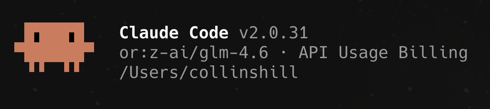
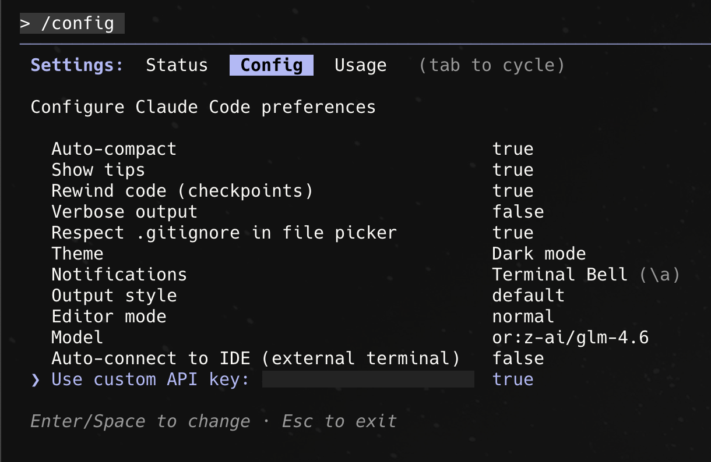

# Castari Proxy



Castari Proxy lets you run the Claude Agent SDK against any model—including OpenRouter catalog models—without changing your agent logic. Install the `castari-proxy` wrapper, point it at the **hosted Castari Worker**, and keep using the same SDK APIs. The worker translates Anthropic-style Messages requests to whichever upstream (Anthropic or OpenRouter) matches the model string you provide.

```
Claude Agent SDK ── queryCastari ──► Castari Worker (hosted)
                                       ├─► Anthropic Messages API
                                       ├─► OpenRouter Chat Completions
                                       └─► *more coming soon*
```

> Don't want to hit the hosted worker? See [Self-Hosting the Worker](#self-hosting-the-worker) for instructions to deploy your own copy.

## Repo Overview

This repository contains three main components that work together to enable multi-provider support for the Claude Agent SDK:

### 1. Wrapper Package (`src/`)
The `castari-proxy` npm package provides `queryCastari()`, a drop-in replacement for the SDK's `query()` function. It:
- Resolves which provider to use based on the model string (e.g., `or:gpt-5-mini` → OpenRouter)
- Intercepts SDK network calls via a global fetch hook
- Injects routing headers and metadata into outgoing requests
- Handles subagent model inheritance for the Task tool

### 2. Cloudflare Worker (`worker/`)
A stateless proxy that translates between API formats. It:
- Routes requests to Anthropic (passthrough) or OpenRouter (with translation)
- Converts Anthropic Messages API ↔ OpenRouter Chat Completions format
- Handles streaming (SSE) translation with tool call assembly
- Enforces server tool policies (MCP, web search, etc.)

### 3. Demo Application (`claude-agent-demo/`)
A full-stack Next.js reference implementation of the Claude Agent SDK featuring:
- 12-model selection UI (3 Claude + 9 OpenRouter models)
- Streaming chat with real-time tool execution visualization
- Image upload support, extended thinking controls, session management
- Transcript recording and permission policies

**For detailed architecture documentation, see [ARCHITECTURE.md](ARCHITECTURE.md).**

## Table of Contents
1. [Repo Overview](#repo-overview)
2. [Demo App](#demo-app)
3. [Migrate to Castari](#migrate-to-castari)
4. [Environment Variables](#environment-variables)
5. [CastariOptions Reference (Advanced)](#castarioptions-reference-advanced)
6. [Task Tool Behavior](#task-tool-behavior)
7. [Claude Code CLI Integration](#claude-code-cli-integration)
8. [Self-Hosting the Worker](#self-hosting-the-worker)
9. [Troubleshooting](#troubleshooting)
10. [Development](#development)

## Demo App
Want a full-stack example? Clone this repo and run the Next.js chat app inside `claude-agent-demo/`:
```bash
git clone https://github.com/castari/castari-proxy.git
cd castari-proxy/claude-agent-demo
npm install
cp .env.example .env   # fill in ANTHROPIC_API_KEY, OPENROUTER_API_KEY, CASTARI_SUBAGENT_MODEL=inherit (or model name).
# set CASTARI_WORKER_URL to https://castari-worker.castari-proxy.workers.dev
npm run dev
```

## Migrate to Castari
You **do not** need to clone this repo to migrate an existing Claude Agent SDK app. Just install the package, set a few env vars, and swap `query()` for `queryCastari()`—the hosted worker handles routing automatically.

### 1. Install dependencies
```bash
npm install @anthropic-ai/claude-agent-sdk castari-proxy
```

### 2. Configure environment variables
Create a `.env` or otherwise set the following in the process running your Claude Agent SDK app. **Both the main model and `CASTARI_SUBAGENT_MODEL` must use the same provider (Anthropic or OpenRouter)**—if you mix providers, the Task tool will try to call the wrong API with the wrong key and fail.
```env
ANTHROPIC_API_KEY=sk-ant-...
OPENROUTER_API_KEY=sk-or-...
CASTARI_WORKER_URL=https://castari-worker.castari-proxy.workers.dev
CASTARI_SUBAGENT_MODEL=inherit   # (required) use the same provider as your main model
```
- `CASTARI_WORKER_URL` points to the hosted Castari Worker. Set `ANTHROPIC_BASE_URL` to this value so the SDK directs all traffic to the worker. The worker then proxies to Anthropic/OpenRouter using the API key you supplied—nothing is stored server-side.
- Need a full `.env` example? See [below](#env-example).

### 3. Replace `query()` with `queryCastari()`
```ts
import { queryCastari, type CastariOptions } from 'castari-proxy';

const options: CastariOptions = {
  model: process.env.MODEL ?? 'or:z-ai/glm-4.6',
  env: {
    ANTHROPIC_API_KEY: process.env.ANTHROPIC_API_KEY!,
    OPENROUTER_API_KEY: process.env.OPENROUTER_API_KEY!,
    ANTHROPIC_BASE_URL: process.env.CASTARI_WORKER_URL!,
    CASTARI_SUBAGENT_MODEL: process.env.CASTARI_SUBAGENT_MODEL ?? 'inherit'
  }
};

const stream = queryCastari({ prompt: 'Audit the repo', options });
for await (const message of stream) {
  // identical semantics to the SDK's query()
}
```
That’s it. The agent SDK now POSTs to the hosted worker, which inspects `options.model` to decide whether to route to Anthropic or OpenRouter.
> ✅ **Minimal migration:** If you already call `query({ prompt, options })`, you only need to (1) swap the import to `queryCastari`, (2) set a provider-aware `model` (e.g., `or:z-ai/glm-4.6`), and (3) provide the env overrides shown above. Everything else (tools, MCP servers, hooks) works unchanged. The detailed `CastariOptions` section below is only needed if you want extra tuning.

## Environment Variables

| Variable | Required? | Description |
| --- | --- | --- |
| `ANTHROPIC_API_KEY` | ✅ | Forwarded to the worker; used when the model resolves to an Anthropic provider. |
| `OPENROUTER_API_KEY` | ✅ if you use OpenRouter models | Forwarded to the worker when the model slug starts with `or:` / `openrouter/` / `openai/`. |
| `CASTARI_WORKER_URL` | ✅ | Base URL of the hosted worker (`https://castari-worker.castari-proxy.workers.dev`). Set `ANTHROPIC_BASE_URL` to this value so the SDK sends all traffic through the worker. |
| `CASTARI_SUBAGENT_MODEL` | ✅ (default `inherit`) | Controls the model used by the SDK’s Task tool subagents. **Required when your main model is not Anthropic**, otherwise the SDK falls back to Haiku and will attempt to hit Anthropic with your OpenRouter key. Accepts `inherit`, `haiku`, `sonnet`, `opus`, or any full slug. |
| `OPENROUTER_DEFAULT_VENDOR` | optional (`openai`) | When you use `or:<model>` without a vendor, Castari prepends this. |
| `CASTARI_REASONING_EFFORT` / `CASTARI_REASONING_SUMMARY` | optional | Default reasoning hints when not provided in `CastariOptions`. |

If you’re using the demo app or other advanced options, see [`claude-agent-demo/lib/env.ts`](claude-agent-demo/lib/env.ts) for the full schema.

### `.env` Example <a id="env-example"></a>
Create a `.env` file in the root of your project (or however you manage env vars) so your server process can read the required values:

```env
# Required for Anthropic routing (still needed even if you mainly use OpenRouter)
ANTHROPIC_API_KEY=sk-ant-123...

# Required when using `or:...` models (or any OpenRouter slug)
OPENROUTER_API_KEY=sk-or-456...

# Hosted Castari Worker
CASTARI_WORKER_URL=https://castari-worker.castari-proxy.workers.dev

# Ensure Task tool subagents match the main provider
CASTARI_SUBAGENT_MODEL=inherit
```

In code, merge these env vars into `options.env` before calling `queryCastari`. See the usage snippet above or [`claude-agent-demo/lib/agent/session.ts`](claude-agent-demo/lib/agent/session.ts) for a complete example.

## CastariOptions Reference (Advanced)
You rarely need anything beyond the env overrides above. But if you do want to layer on metadata, per-provider keys, or reasoning hints, `CastariOptions` extends the SDK’s `Options` type:

```ts
interface CastariOptions extends Options {
  providers?: {
    anthropic?: { apiKey?: string };
    openrouter?: { apiKey?: string };
  };
  meta?: {
    app?: string;
    clientId?: string;
    deploymentId?: string;
    version?: string;
    reasoningEffort?: ReasoningEffortPreference;
    reasoningSummary?: ReasoningSummaryPreference;
  };
  reasoning?: ReasoningConfig;
  reasoningEffort?: ReasoningEffortPreference;
  reasoningSummary?: ReasoningSummaryPreference;
  subagentModel?: string;
}
```
- `providers` lets you override API keys per provider; env vars remain the default.
- `meta` is forwarded via `x-client-meta` for observability.
- `reasoning`/`reasoningEffort`/`reasoningSummary` feed into the worker’s reasoning translator.
- `subagentModel` allows per-query overrides for the Task tool (otherwise the wrapper falls back to `CASTARI_SUBAGENT_MODEL` or the main `options.model`).

## Self-Hosting the Worker
Prefer your own worker (different Cloudflare account, AI Gateway, or custom policies)?

1. Clone this repo and cd into `worker/`.
2. Install dependencies: `npm install`.
3. Edit `wrangler.toml` with your account ID, upstream URLs, and desired defaults.
   - Defaults are set to the raw Anthropic (`https://api.anthropic.com`) and OpenRouter (`https://openrouter.ai/api`) endpoints.
   - If you want to insert your own AI Gateway, change `UPSTREAM_*` settings or set them at deploy time.
4. Deploy:
   ```bash
   npx wrangler login
   npm run deploy
   ```
5. Point `CASTARI_WORKER_URL` in your app to `https://<your-worker>.workers.dev` instead of the hosted URL.

The worker is stateless: it forwards client-supplied API keys/tokens directly to the upstream and streams responses back. No persistence or logging is performed by default.

## Claude Code CLI Integration
You can also use the hosted Castari Worker directly from the Claude Code CLI (`claude code`). Set these environment variables before launching the CLI so all requests route through Castari:

```bash
export ANTHROPIC_BASE_URL=https://castari-worker.castari-proxy.workers.dev
export ANTHROPIC_API_KEY=$OPENROUTER_API_KEY          # or your Anthropic key if you’re staying on Claude models
export ANTHROPIC_MODEL=or:gpt-5-mini                  # any OpenRouter slug works
export CLAUDE_CODE_SUBAGENT_MODEL=or:gpt-5-mini       # must share the same provider as ANTHROPIC_MODEL (Anthropic or OpenRouter)
```
**Important:** make sure the main model and subagent model point at the **same provider**. If you use an OpenRouter slug for `ANTHROPIC_MODEL`, set `CLAUDE_CODE_SUBAGENT_MODEL` to the same (or another OpenRouter slug). Mixing Anthropic and OpenRouter in Claude Code will cause the Task tool to call the wrong API with the wrong key.

To ensure Claude Code uses your environment key instead of a console subscription, run `/config` inside the CLI, scroll to the bottom, and toggle **“Use custom API key”** to `true`. That forces the CLI to respect `ANTHROPIC_API_KEY` (the same key you exported above). If you previously signed in with `claude login`, unset `CLAUDE_CLOUD_API_KEY` so the CLI doesn’t override your custom key.



The demo automatically syncs the local `castari-proxy` package before each dev run, so changes you make in `src/` are immediately reflected.

## Troubleshooting
- **Task tool still hitting Anthropic:** Restart your app after changing `CASTARI_SUBAGENT_MODEL`. Confirm `process.env.CLAUDE_CODE_SUBAGENT_MODEL` is set (the wrapper should log an error if it can’t resolve the subagent model).
- **OpenRouter calls rejected:** Ensure `OPENROUTER_API_KEY` is present either in env or `options.providers.openrouter.apiKey`. Also check that the model slug starts with `or:` / `openrouter/` / `openai/` so the wrapper resolves provider=`openrouter`.
- **Worker 404:** The worker only handles `POST /v1/messages`. Make sure your `CASTARI_WORKER_URL` includes `/v1/messages` and you’re issuing POST requests.
- **Need detailed logs:** Deploy your own worker and add logging, or layer Cloudflare AI Gateway / logpush on top of the upstream endpoints.

## Development
- Package lint/tests: `cd src && npm pack --silent --json`
- Worker dev: `cd worker && npm run dev`
- Demo tests: `cd claude-agent-demo && npm test`

## Contributions Welcome

## License
MIT © Castar Ventures, Inc.
